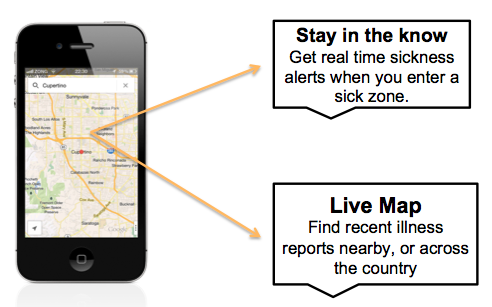
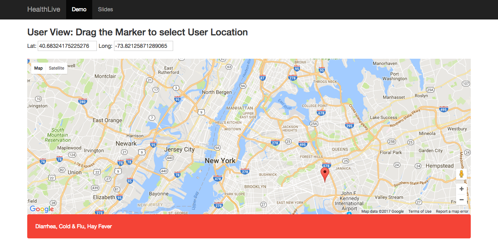
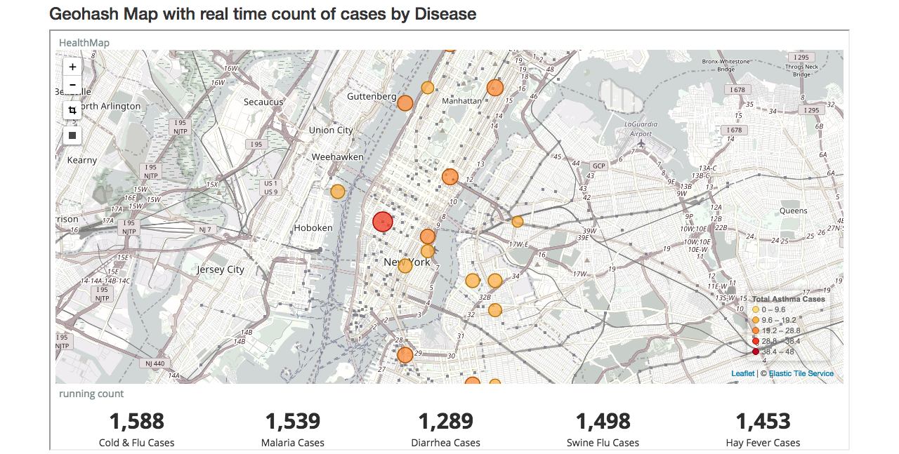

# HealthLive
### Insight Data Engineering Project
======================================

## A Near Real Time Sickness Tracker 
Demo - [www.healthlive.site/](http://www.healthlive.site/)


[Slides](http://www.slideshare.net/vaibhavlella1234/healthlive)

# What is HealthLive? 

Just as Doppler radar scans the skies for indicators of bad weather, HealthLive scans the drug sales at pharmacies across the globe for indicators of illness, allowing you to check for the chance of sickness as easily as you can check for chance of rain. 



# Motivation behind HealthLive 

Drug sales data may earlier capture changing population health status, as over-the-counter (OTC) sales and a dense network of pharmacies in most developed countries make drugs easily accessible to patients at the earliest appearance of their symptoms. Sudden increase in the sales of particular drugs might serve as an early indicator of communitywide disease outbreaks. Despite this potential interest, no state of the art of drug sales based surveillance is available to date this motivated me to use my data engineering skills to demo a proof of concept.

# Technologies Used
 - Data Source
	 - Simulated Real Time pharmacy sales data 
 - Ingestion
	 - Apache Kafka
 - Stream Processing
	 - Spark Streaming
 - Storage
	 - Elasticsearch (geo-spatial queries)
 - UI
	 - Flask with Google Maps, Kibana
 - Hosting
     - AWS EC2






# HealthLive Approach
HealthLive ingests real-time pharmacy sales data, which are processed in real-time to keep a check on the rising sales of drugs belonging to a broader disease category in all the pharmacies and depending on the user location the sales of nearby pharmacies is analysed to detect increased sales and the user is notified of the possible diseases in his/her locality. 

![HealthLive Pipeline] (images/pipeline.png)

## Data Source

 - Synthetic Data: Simulated Real Time pharmacy sales data
 - Total of 10k Pharmacies spread across cities like New York, Chicago, Paris and New Delhi. 

JSON message fields:

 - timestamp [year month day hour minute second]: time when parking pharmacy sales data is generated
 - PharmacyID : Unique identifier for the pharmacy
 - Drug: Name of the drug purchased
 - Disease: Name of the disease category to which the purchased drug belongs
 - [lat, lon]: geographic co-ordinates of the Pharmacy

## Data Ingestion
JSON messages were consumed and put into Kafka queue using the kafka-python and the Messages were published to a single topic with Spark Streaming and HDFS acting as consumers. 

## Real-time Processing
Messages streamed into Spark Streaming with the spark-kafka connector.
Real-time views were directly written into Elasticsearch in a Map-Reduce fashion.
Depending on the user's location utilizing Elasticsearch's geo-spatial query functionality the pharmacy records within 10 Mile radius of the user are retrieved and analysed for spike in drug sales and appropriate alert is given mentioning the probable diseases in the vicinity.

## Elasticsearch mapping

``` json
"healthlivetest": {
    "properties": {
        "location": {
            "type" : "geo_point"
        },
        "date": {
            "type" : "date",
            "doc_values" : true,
            "format" : "yyyy-MM-dd HH:mm:ss.SSS"
        }
    }
}
```
## API calls
Disease within 10 mile radius of given lat and lon can be displayed in the browser by calling the following endpoint
- /getDiseases?lat=xxx&lng=xxx

